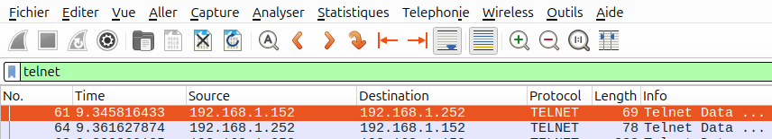
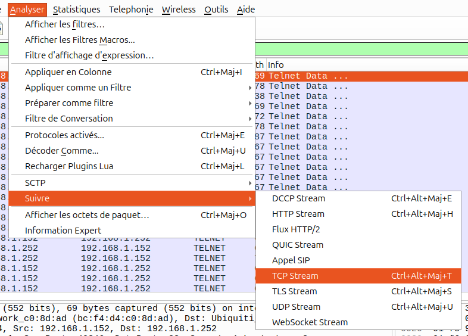
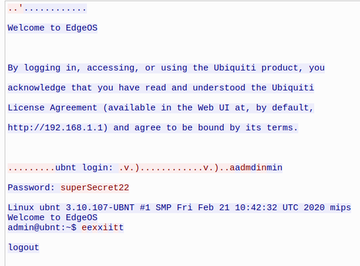

# Flag'Malo 2024

## Connexion vétuste

Réseau - Easy

### Contenu

Le challenge est composé d’un fichier wireshark.

### Résolution

Dans le contenu du fichier wireshark on remarque des échanges avec le protocole Telnet.

C'est un protocole reconnu comme vulnérable, qui ne chiffre pas les échanges.

Afin de facilement observer les échanges, on peut filtrer les trames telnet :

Puis suivre les flux en se rendant dans *Analyser* / *Suivre* / *TCP Steam* :

On peut voir que le mot de passe est superSecret22.

### Flag

Le flag est FMCTF{superSecret22}
