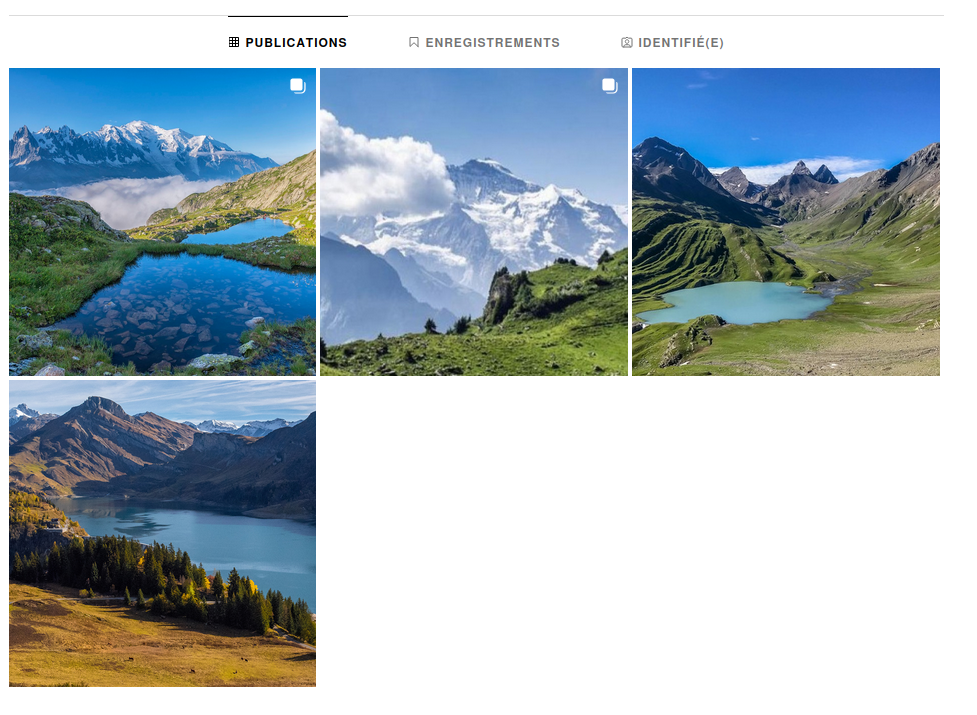

# Flag'Malo 2024

## Enquête 1/3 Réunion d'initiation

Osint - Medium

### Résolution

En partant du nom donné, on peut trouver un compte twitter : https://x.com/francis_pa99827

Il a de nombreux tweet inintéressant, mais un peu retenir notre attention :

On se rend alors sur son compte instagram : darkfrancis666

En observant les photos, on peut trouver sur l'une d'elles une personne d'identifié : jtulipe45

Le compte est vide, mais on obtient une information, le nom, Jeanne Pasquet.

En cherchant plus d'information sur Jeanne sur internet, on peut trouver un compte LinkedIn :

On peut voir qu'elle est secrétaire au sein de l'ARPIV.

Avec plus de recherche, on peut voir qu'il s'agit d'une organisation à but non-lucratif.

Aussi, une autre personne dont on ne peut pas avoir le nom semble y travailler en tant que colporteur.

Afin de contourner la censure de LinkedIn, on peut passer par une recherche Google simple *linkedin arpiv* :

On trouve alors le nom du colporteur, Seb Dupand. On a également accès à son compte linkedin avec seulement deux posts :

Le premier nous intrigue, on sait qu'il s'est rendu à une réunion de l'ARPIV, notre objectif. On apprend également qu'il en a profité pour randonner.

De nombreuses personnes utilisent des applications pour enregistrer leur parcours quand ils courent ou randonnent et la plus connue est Strava.

Avec une petite recherche sur Strava, on trouve un compte du même nom et de la même ville, Rennes.

On peut voir qu'il a une activité d'enregistrée, et en regardant de plus près le parcours, on remarque qu'il s'est arrêté pendant un moment avant de faire demi-tour, sûrement pour assister à la réunion.

On peut rapidement retrouver l'endroit sur Google Maps, les Mégalithes du Carrefour de la Grande Lune :

En essayant d'en apprendre plus sur l'endroit, on ne trouve rien dans les avis, en revanche, une photo révèle une information cruciale :

On a donc trouvé le bon endroit et le flag !

### Flag

Le flag est FMCTF{PEDRO_FOREST}

