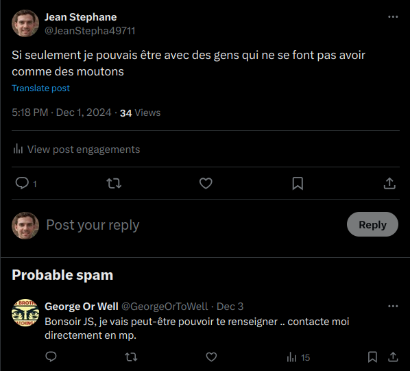
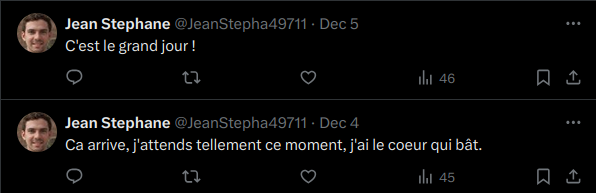
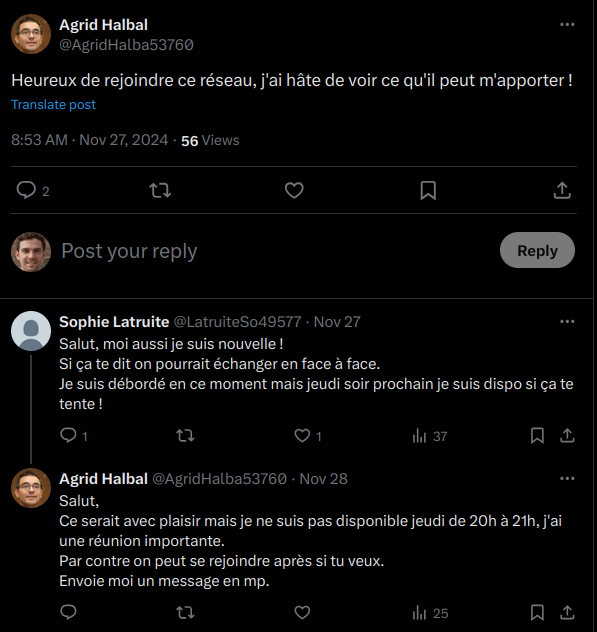
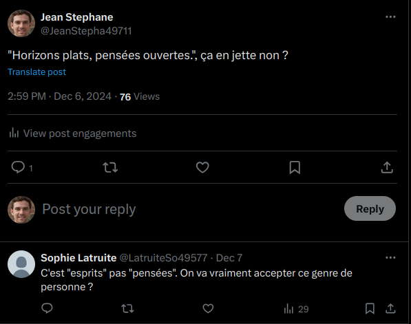

# Flag'Malo 2024

## Enquete-2-3-Infiltration

Osint - Medium

### Résolution

La première étape consiste à trouver le bon point de contact depuis le compte twitter fourni.
En lisant les tweets de Jean Stephane, on voit qu'il est à la recherche d'un groupe partageant ses idées.
En réponse à un de ses appels, un compte nommé *George Or Well* lui propose de le contacter en DM pour l'aider.
On peut alors supposer que ce compte puisse être un bon point de contact.

En le contactant, si on lui fait croire que l'on est intéressé pour devenir membre de l'association et que l'on a participé à une réunion d'initiation, il va nous poser 4 questions pour s'assurer de notre sérieux :
	- Quel est le nom de l'association ?
		On connait la réponse avec l'étape précédente : ARPIV

	- Quel est l'élément central des réunions d'initiations ?
		On connait également la réponse avec l'étape précédente : Les mégalithes

	- Quel est la date et l'heure de la dernière réunion d'initiation ?
		En explorant le compte twitter de Jean Stéphane, on peut voir que depuis son échange avec Georges Or Well, il attendait avec impatience le jeudi 5 décembre. On peut alors supposer qu'il s'agissait de sa réunion d'initiation.
		

		Pour l'heure, on peut la trouver grâce à des comptes en lien avec Jean Stephane.
		Parmi ses followers on retrouve notamment Sophie Latruite, qui a intéragi dans un unique tweet avec Georges Or Well en parlant de son recrutement.
		Ses cependant dans ses réponses que l'on va pouvoir obtenir l'heure, elle interagi avec un certains Agrid Halbal qui semble occupé le jeudi 5 décembre, de 20h à 21h pour une réunion importante.
		

		La réponse est donc le jeudi 5 décembre à 20h.

	- Quel est le slogan de l'association ?
		Pour cette dernière question il faut s'intéressé au tweet de Jean Stephane, qui aime la phrase : *"Horizons plats, pensées ouvertes."*
		Celle-ci à la forme d'un slogan, mais il faut préter attention à la réponse de Sophie Latruite qui vient le corriger :
		

		Le bon slogan est *Horizons plats, esprits ouverts*

Une fois les 4 réponses données, George Or Well nous accepte en tant que membre et nous donne accès au drive de l'association, point essentiel pour la dernière étape :
	Le lien : https://drive.proton.me/urls/R36KB56FB0#fugfnd1LzqL5
	Le mot de passe : FMCTF{BigDriveOfInformation}

### Flag

Le flag est FMCTF{BigDriveOfInformation}
