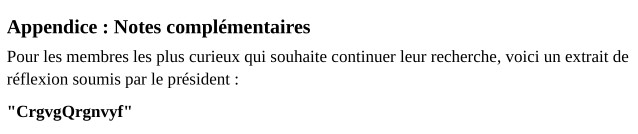
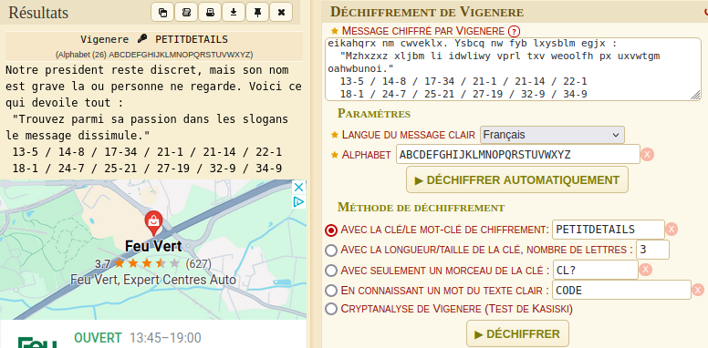
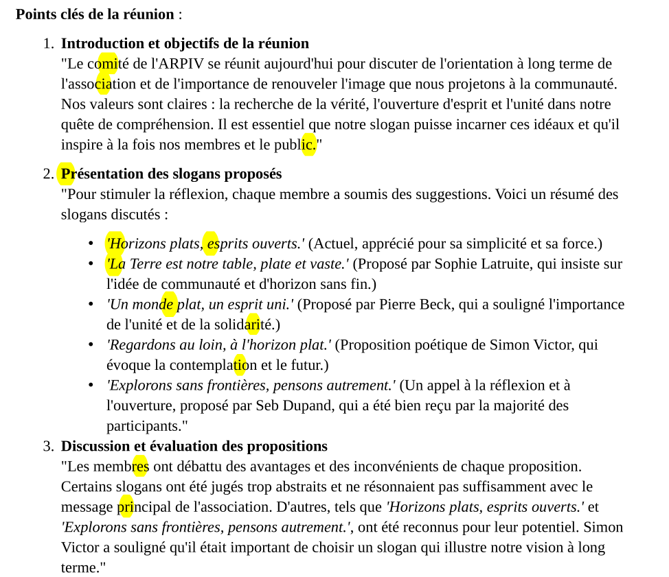

# Flag'Malo 2024

## Enquete 3/3 Exploration

Osint - Medium

### Contenu

La recherche du nom du président se déroule exclusivement dans le drive obtenu à l'étape précédente :

Lien : https://drive.proton.me/urls/R36KB56FB0#fugfnd1LzqL5 \
Mot de passe : FMCTF{BigDriveOfInformation}

Le drive est rempli de fichier traitant de la théorie de la terre plate, sujet principal de l'ARPIV, ainsi que des documents administratif de l'association.

### Résolution

On trouve régulièrement des références au président et notamment ses initiales : M.P.

Mais seuls trois fichiers contiennent des informations utiles :
- Dans le fichier "Rapport_Réunion2024" du dossier "Divers" on trouve à la fin :
  
  

  Le texte *CrgvgQrgnvyf* est en ROT13 et donne : *PetitDetails*

- Dans le fichier "notes.cipher" du dossier "Secrets" on trouve un texte incompréhensible :
  > Csmzx svxsqowcx kmlwi wianjtx, fibv whn vze twm okdzx li zm eikahqrx nm cwveklx. Ysbcq nw fyb lxysblm egjx :
  "Mzhxzxz xljbm li idwliwy vprl txv weoolfh px uxvwtgm oahwbunoi."
  13-5 / 14-8 / 17-34 / 21-1 / 21-14 / 22-1
  18-1 / 24-7 / 25-21 / 27-19 / 32-9 / 34-9

  Il s'agit d'un texte chiffré en Vigenère avec la clé PetitDetails. \
  Le site [dCode](https://www.dcode.fr/chiffre-vigenere), pour exemple, permet très facilement de déchiffrer le texte.
  
  

  On obtient alors :
  > Notre president reste discret, mais son nom est grave la ou personne ne regarde. Voici ce qui devoile tout :
  "Trouvez parmi sa passion dans les slogans le message dissimule."
  13-5 / 14-8 / 17-34 / 21-1 / 21-14 / 22-1
  18-1 / 24-7 / 25-21 / 27-19 / 32-9 / 34-9

- Le message fait référence au fichier "Réunion_Slogan.pdf" du dossier "Archives" et les chiffres correspondent à des duos de ligne et lettre (exemple : 13-5 :  13èmes lignes, 5èmes lettres).

  On obtient les lettres suivantes :
  
  

Le nom obtenu, celui du président, est Michel Perier.

### Flag

Le flag est FMCTF{Michel_Perier}
