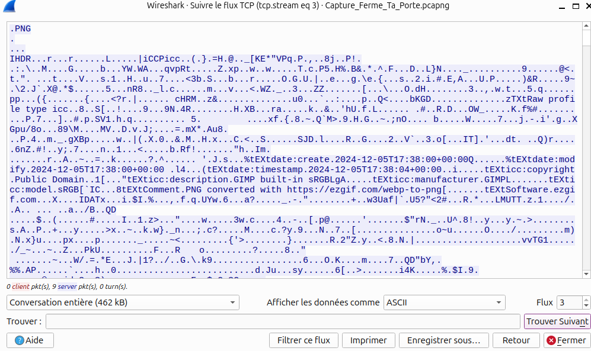

# Flag'Malo 2024

## Ferme ta porte

Réseau - Easy

Co-écrit avec rizlaaa

### Contenu

Le challenge est composé d’un fichier wireshark.

### Résolution

En se baladant parmi les trames, on peut remarquer la présence d'échanges FTP.

Deux indices peuvent nous indiquer que l'on est sur la bonne piste :

- L'énoncé qui nous indique que des données ont été partagées sur le réseau, or c'est exactement le but de FTP.

- Le nom du challenge dont les initiales forment FTP (**F**erme **T**a **P**orte).

On filtre alors les trames FTP et on remarque que le fichier *plan.png* a été transmis sur le réseau :

*On peut également relever que l'identifiant et le mot de passe de connexion au FTP sont transmis en clair, mais ce n'est pas notre objectif.*

Pour transmettre les données, c'est le protocole **ftp-data** qui est utilisé, on va donc modifier notre filtre :

Pour obtenir les données du fichier on va sélectionner une trame ayant envoyé des données de plan.png et suivre les flux TCP :

Les données sont par défaut formatées en ASCII, cependant nous avons besoin ici des données en brute (raw) :

On va pouvoir les enregistrer dans un fichier que l'on va bien nommer avec le format .png.

On découvre alors le fichier contenant le flag :

### Flag

Le flag est FMCTF{Tu_M_As_Trouve}
