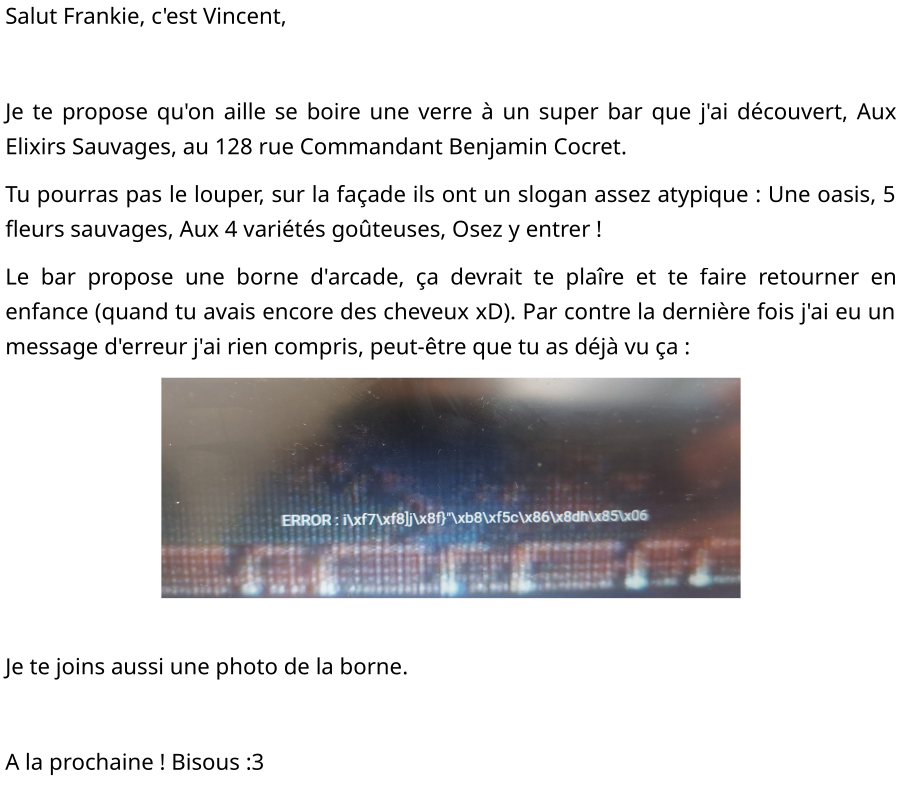
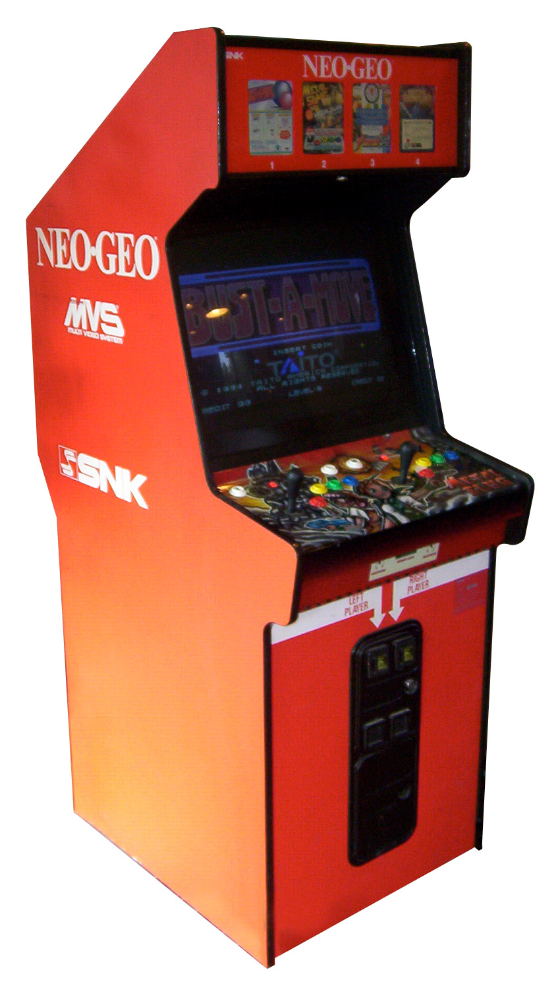

# Flag'Malo 2024

## Inception

Stegano - Hard

### Contenu

- Un mail :



- Une photo de borne d'arcade :



### Résolution

Avant tout, il faut comprendre quoi faire.

En lisant le mail, deux informations sont à retrouver :

- Le nom de l'établissement avec l'adresse, en prennant les chiffres et initiales donne : AES-128-CBC

    **_A_***ux* **_E_***lixirs* **_S_***auvages, au* **_128_*** rue* **_C_***ommandant* **_B_***enjamin* **_C_***ocret*

- L'image inclut dans le mail à un message d'erreur qui a un format hexadécimal *i\xf7\xf8]j\x8f}"\xb8\xf5c\x86\x8dh\x85\x06*

    On peut alors se douter que cela sera utile.

Maintenant, si on s'intéresse à l'image en pièce jointe, il y a une information à trouver :

- Dans les métadonnées il y a un commentaire : *MaBelleArcadeKey* qui de part sont nom semble être une clé.

On a maintenant 3 éléments intéressant. La première idée est de vouloir déchiffrer l'hexadécimal de l'AES-128-CBC avec la clé.

Il nous manque cependant un élément, l'IV et justement, l'héxadécimal du message d'erreur fait la bonne longueur pour être un IV.

On peut donc en déduire qu'il y a une autre chose à déchiffrer.

L'indice donné parle d'ange et cela fait référence à une méthode nommé l'angecryption.

Elle consiste à pouvoir révéler un fichier en en chiffrant un autre.

Il faut donc chiffrer l'image en pièce jointe en utilisant les éléments découvert.

Pour cela on peut écrire un programme simple ():

```
from Crypto.Cipher import AES
from Crypto.Util.Padding import pad

def encrypt_image_aes_128(input_image_path, output_encrypted_path, key, iv):
    # Vérifier la longueur de la clé et de l'IV
    if len(key) != 16:
        raise ValueError("La clé doit être exactement de 16 octets (128 bits).")
    if len(iv) != 16:
        raise ValueError("L'IV doit être exactement de 16 octets (128 bits).")

    # Lire l'image en binaire
    with open(input_image_path, "rb") as file:
        image_data = file.read()

    # Ajouter du padding aux données pour correspondre à un multiple de la taille du bloc (16 octets)
    padded_data = pad(image_data, AES.block_size)

    # Chiffrer avec AES en mode CBC
    cipher = AES.new(key.encode('utf-8'), AES.MODE_CBC, iv)
    encrypted_data = cipher.encrypt(padded_data)

    # Écrire les données chiffrées dans un fichier
    with open(output_encrypted_path, "wb") as file:
        file.write(encrypted_data)

    print(f"Image chiffrée avec succès et sauvegardée dans {output_encrypted_path}")

if __name__ == "__main__":
    # Fichier d'entrée et de sortie
    input_image = "piecejointe.png"  # Image d'entrée
    output_encrypted = "result.png"  # Fichier chiffré de sortie

    # Clé et IV spécifiés
    key = "MaBelleArcadeKey"  # Clé de 128 bits (16 caractères)
    iv = b'i\xf7\xf8]j\x8f}"\xb8\xf5c\x86\x8dh\x85\x06'  # IV exact en bytes

    # Chiffrer l'image
    encrypt_image_aes_128(input_image, output_encrypted, key, iv)
```

Au final on trouve donc l'image suivante :


### Flag

Le flag est FMCTF{Angecryption_Is_Cool}
