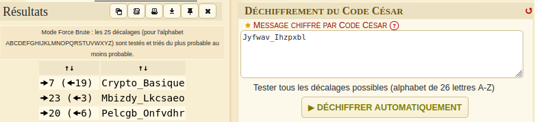

# Flag'Malo 2024

## Origine du chiffrement

Crypto - Easy

### Résolution

On a au départ : **Jyfwav_Ihzpxbl**

Le titre évoquant l'origine du chiffrement fait penser au code César.

Il nous manque seulement le décalage.

Des outils comme [dCode](https://www.dcode.fr/chiffre-cesar) permettent de tester les différentes possiblitées et de retourner celle qui ressemble le plus à un vrai texte.

Le site nous retourne *Crypto_Basique* avec un décalage de 7.

### Flag

Flag : FMCTF{Crypto_Basique}
