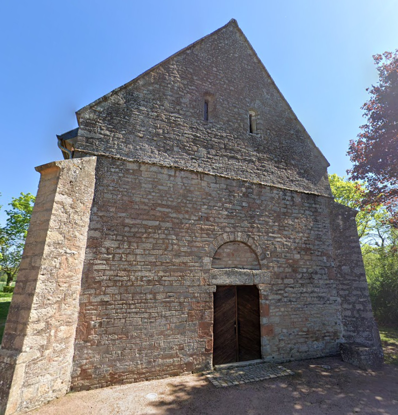

# Flag'Malo 2024

## Retrouver-un-ami

OSINT - Medium

### Enoncé

L'été dernier, j'ai visité une superbe ville et j'ai fini chez une personne super sympathique à boire un café. Il avait un établissement un peu étrange de référencé. Je voudrais lui envoyer une lettre pour reprendre contact, mais j'ai malheureusement oublié son adresse. Pouvez-vous m'aider à retrouver le nom de son établissement ?

Pour vous aider, voici un récap de ma journée :
   - J'ai pris une photo d'un magnifique bâtiment que j'ai visité le matin.
   - J'ai ensuite fait un tour sur l'eau, je suis allé manger une pizza puis j'ai fait une manucure.
   - J'ai gribouillé un dessin en me baladant en ville.
   - Puis j'ai bu un bon café avec mon ami d'un jour.

Format attendu du flag : FMCTF{lieu}

### Complément

Une fois la boutique pour les ongles trouvée, partez de la route en bas de celle-ci.

### Ressources

- [gribouillage.pdf](gribouillage.pdf)

