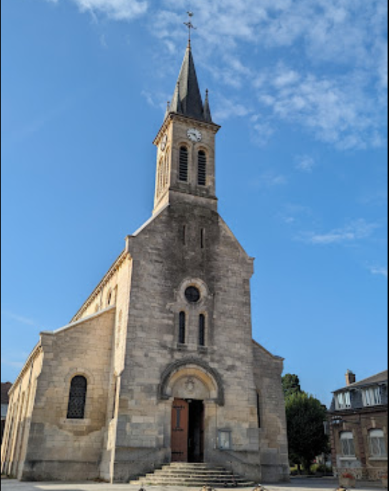
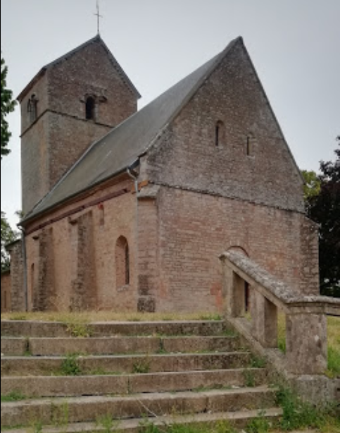
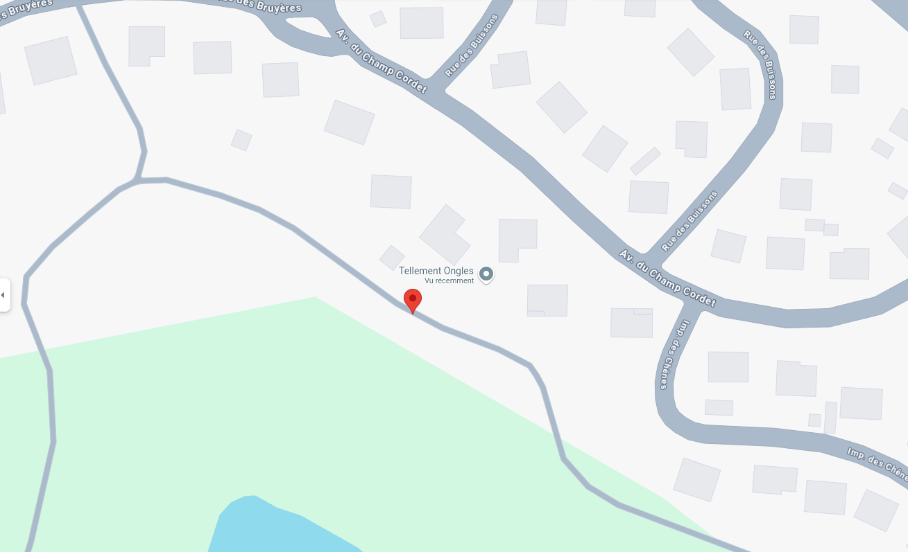

# Flag'Malo 2024

## Retrouver-un-ami

OSINT - Medium

### Résolution

Il faut commencer par retouver le lieu de la photo.

Avec une recherche inversée sur Google Image, on peut retrouver le bâtiment :

Le premier résultat nous amène à une page [wikipédia](https://fr.m.wikipedia.org/wiki/Fichier:Torcy_-_Eglise_Saint-Barth%C3%A9lemy_-_02.jpg), le bâtiment est l'Eglise Saint-Barthélemy à Torcy.

Il faut cependant être prudent car il existe deux églises du même nom dans la ville du même nom.

- L'une est à Torcy en Seine-et-Marne :

- L'autre est à Torcy en Saône-et-Loire :

Il faut donc bien s'assurer, sur Google Maps par exemle, que l'église correspond.

L'indication suivante indique un tour sur l'eau, on peut alors supposer qu'il a traversé l'étang, pour se rendre au Yatch Club Le Creusot.

Il est allé manger une pizza, la pizzeria la plus proche est La Spaggia.

Enfin il s'est fait une manucure et l'établissement le plus proche de la pizzeria proposant ce service est Tellement Ongles.

La dernière étape est donc de suivre le gribouillage pour se déplacer en ville et retrouver son ami.

L'indice de l'énoncé nous informe qu'il faut partir de la route du bas, on partira donc du point suivant :

Pour comprendre le fonctionnement du gribouillage, on peut faire une recherche inversée sur Google Image.

### Flag

Le flag est FMCTF{Charmeandcie}
