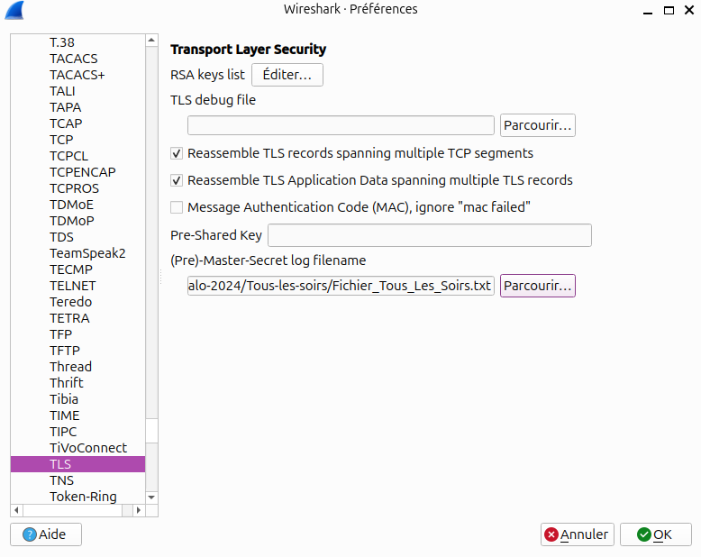
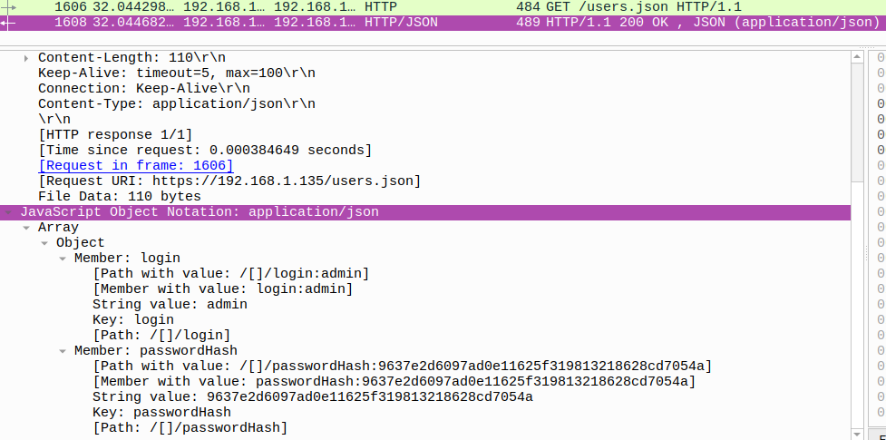
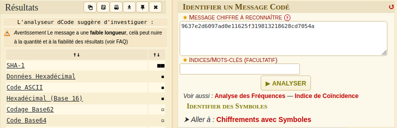

# Flag'Malo 2024

## Tous-les-soirs

Réseau - Medium

Co-écrit avec rizlaaa

### Résolution

En analysant le fichier texte, on peut remarquer qu'il contient des clés TLS pouvant être utilisé pour chiffrer des échanges.

Justement, la capture Wireshark contient des échanges utilisant TLS.

Afin d'appliquer le fichier texte dans Wireshark, il faut se rendre dans *Editer / Préférences / Protocols / TLS* et fournir dans le champs *(Pre)-Master-Secret log filename* le fichier texte.



L'un des protocoles très connu qui utilise du TLS pour se sécuriser est HTTP. De plus, c'est un protocole qui est beaucoup utilisé pour des interfaces de connexion web.

On va donc filtrer la capture en HTTP et une trame nous interpelle, un *GET /users.json*.

En analysant la trame suivante on obtient le contenu du fichier qui est envoyé par le serveur :



On a maintenant le hash du mot de passe mais on ne sait pas de quel type il est.

Le site [dCode](https://www.dcode.fr/identification-chiffrement) permet d'identifier les méthodes de chiffrement. En passant le hash dans l'outil, dCode estime qu'il s'agit de SHA1.



Cependant dCode n'arrive pas à trouver le résultat du hash.

On va donc utiliser un autre outil qui permettra une attaque en utilisant un dictionnaire comme rockyou.txt.

Il en existe deux bien connus, **hashcat** et **John the Ripper**.

En utilisant hashcat on obtient :
```
$ hashcat -a 0 -m 100 hash.txt rockyou.txt
hashcat (v6.2.6) starting

OpenCL API (OpenCL 3.0 PoCL 6.0+debian  Linux, None+Asserts, RELOC, LLVM 17.0.6, SLEEF, DISTRO, POCL_DEBUG) - Platform #1 [The pocl project]
============================================================================================================================================
* Device #1: cpu-haswell-AMD Ryzen 5 7520U with Radeon Graphics, 2464/4992 MB (1024 MB allocatable), 8MCU

Minimum password length supported by kernel: 0
Maximum password length supported by kernel: 256

Hashes: 1 digests; 1 unique digests, 1 unique salts
Bitmaps: 16 bits, 65536 entries, 0x0000ffff mask, 262144 bytes, 5/13 rotates
Rules: 1

Optimizers applied:
* Zero-Byte
* Early-Skip
* Not-Salted
* Not-Iterated
* Single-Hash
* Single-Salt
* Raw-Hash

ATTENTION! Pure (unoptimized) backend kernels selected.
Pure kernels can crack longer passwords, but drastically reduce performance.
If you want to switch to optimized kernels, append -O to your commandline.
See the above message to find out about the exact limits.

Watchdog: Temperature abort trigger set to 90c

Host memory required for this attack: 2 MB

Dictionary cache built:
* Filename..: rockyou.txt
* Passwords.: 14344391
* Bytes.....: 139921497
* Keyspace..: 14344384
* Runtime...: 1 sec

9637e2d6097ad0e11625f319813218628cd7054a:Saintmalo07

Session..........: hashcat
Status...........: Cracked
Hash.Mode........: 100 (SHA1)
Hash.Target......: 9637e2d6097ad0e11625f319813218628cd7054a
Time.Started.....: Tue Dec 10 09:37:49 2024 (2 secs)
Time.Estimated...: Tue Dec 10 09:37:51 2024 (0 secs)
Kernel.Feature...: Pure Kernel
Guess.Base.......: File (rockyou.txt)
Guess.Queue......: 1/1 (100.00%)
Speed.#1.........:  4915.6 kH/s (0.14ms) @ Accel:512 Loops:1 Thr:1 Vec:8
Recovered........: 1/1 (100.00%) Digests (total), 1/1 (100.00%) Digests (new)
Progress.........: 10616832/14344384 (74.01%)
Rejected.........: 0/10616832 (0.00%)
Restore.Point....: 10612736/14344384 (73.99%)
Restore.Sub.#1...: Salt:0 Amplifier:0-1 Iteration:0-1
Candidate.Engine.: Device Generator
Candidates.#1....: Saran2345 -> Sabo2008
Hardware.Mon.#1..: Temp: 78c Util: 37%

Started: Tue Dec 10 09:37:16 2024
Stopped: Tue Dec 10 09:37:54 2024

```

Le mot de passe est trouvé, il s'agit de Saintmalo07

### Flag

Le flag est FMCTF{Saintmalo07}
